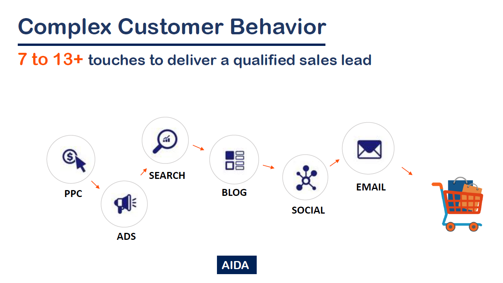
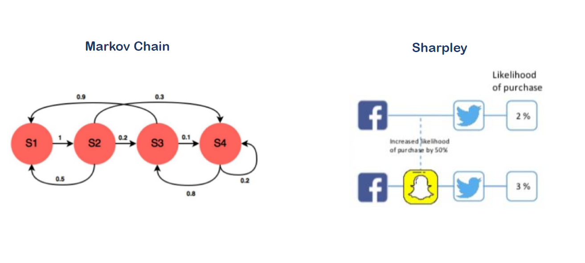
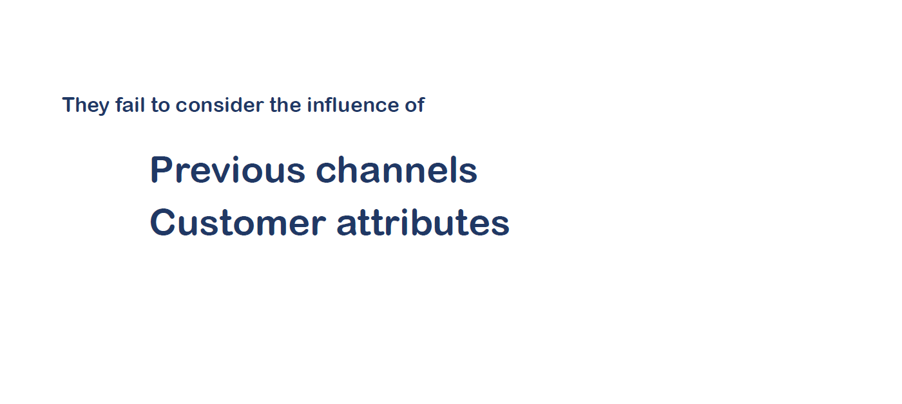
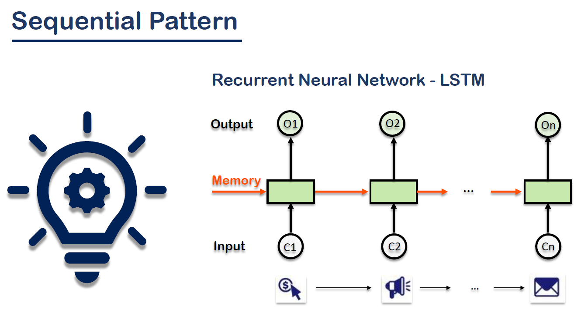
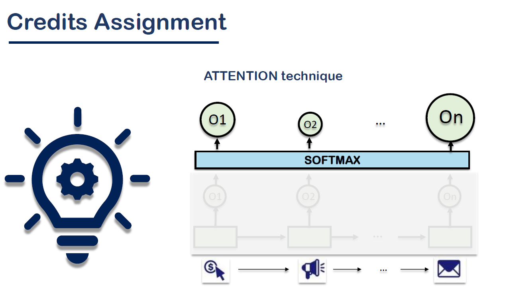
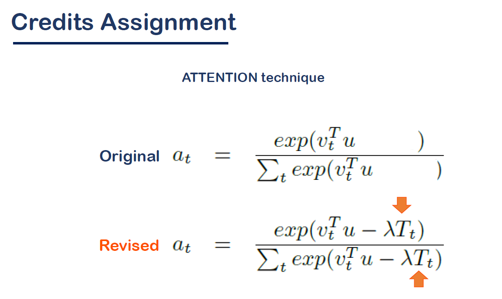
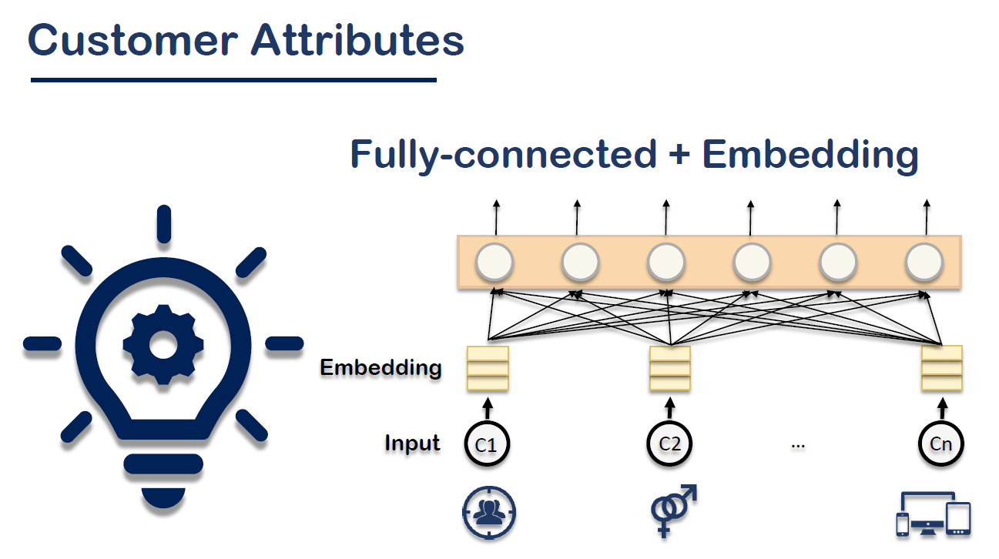
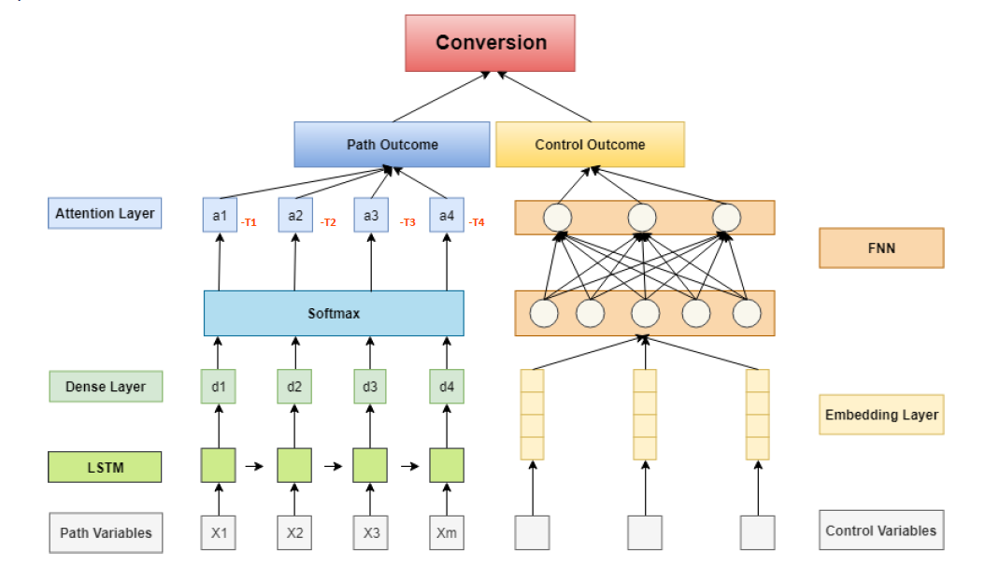

# channel-attribution-model
An attention-based Recurrent Neural Net multi-touch attribution model in a supervised learning fashion of predicting if a series of events leads to conversion (purchase). The trained model can also assign credits to channels. The model also incorporates user-context information, such as user demographics and behavior, as control variables to reduce the estimation biases of media effects.

# backgroud
It involves morethan 7-13 touches before a customer making a purchase

# current channel-attribution model
Besides the rule-based model, the Markov and Sharpley are quite famous, but they all failed to consider the influence of old channels or the customer profile

# a brand-new architecture utilizes LSTM and Attention to deal with sequencial channel data, DNN with customer profile data
LSTM + Attention

revised softmax function to include the time-decay factor

Embed customer profile data

the overall architecture

